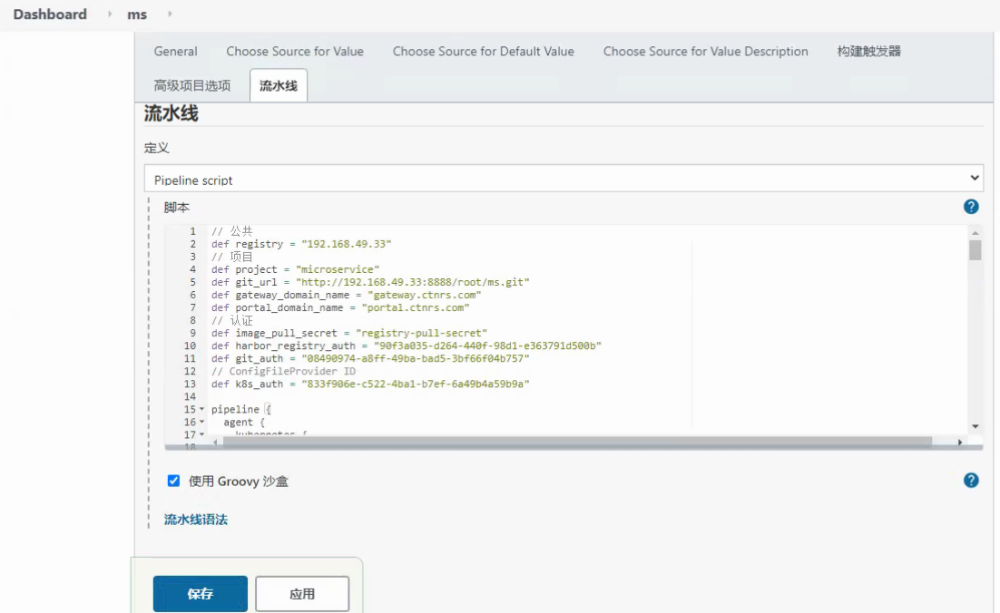

# 1、准备基础环境
> - 1.1 部署K8S环境
> - 1.2 部署镜像仓库Harbor
> - 1.3 部署代码版本仓库GitLab
> - 1.4 部署包管理器Helm v3
> - 1.5 部署数据库MariaDB
> - 1.6 部署注册中心Eureka
> - 1.7 部署PV自动供给（NFS）


## 1.0 规划

| IP            | 节点       | 描述                                                         |
| ------------- | ---------- | ------------------------------------------------------------ |
| 192.168.49.30 | k8s-master | kube-apiserver、kube-schedule、kube-cotronler-manager、etcd、docker、kubelet、kube-proxy |
| 192.168.49.31 | K8s-node01 | kubelet、kube-proxy、docker                                  |
| 192.168.49.32 | k8s-node02 | kubelet、kube-proxy、docker                                  |
| 192.168.49.33 | storage    | NFS、Harbor、GitLab、MariaDB、docker、helm v3                |


## 1.1 部署K8S集群

> - 192.168.49.30
> - 192.168.49.31
> - 192.168.49.32
> - 192.168.49.33


### 1.1.1 集群初始化

> - 192.168.49.30
> - 192.168.49.31
> - 192.168.49.32
> - 192.168.49.33


### 1.1.2 安装kubeadm

> - K8s-master
> - K8s-node01
> - K8s-node02

```sh
# 设置K8S国内源
cat <<EOF > /etc/yum.repos.d/kubernetes.repo
[kubernetes]
name=Kubernetes
baseurl=http://mirrors.aliyun.com/kubernetes/yum/repos/kubernetes-el7-x86_64
enabled=1
gpgcheck=0
repo_gpgcheck=0
gpgkey=http://mirrors.aliyun.com/kubernetes/yum/doc/yum-key.gpg
 		  http://mirrors.aliyun.com/kubernetes/yum/doc/rpm-package-key.gpg
EOF
# 安装kubeadm
yum -y install kubeadm-1.20.9 kubectl-1.20.9 kubelet-1.20.9
systemctl enable kubelet.service
```
### 1.1.3 初始化master节点（命令行方式）

> - K8s-master

```sh
# 拉取镜像
# 可以先拉取镜像
kubeadm config images pull \
	--image-repository registry.aliyuncs.com/google_containers \
	--kubernetes-version v1.20.9
	
# 初始化安装Master相关组件
kubeadm init \
	--control-plane-endpoint=192.168.49.30:6443 \
	--image-repository registry.aliyuncs.com/google_containers \
	--kubernetes-version v1.20.9 \
	--service-cidr=10.10.0.0/16 \
	--pod-network-cidr=10.244.0.0/16
	
# 设置环境
mkdir -p $HOME/.kube
sudo cp -i /etc/kubernetes/admin.conf $HOME/.kube/config
sudo chown $(id -u):$(id -g) $HOME/.kube/config
```
### 1.1.3+ 初始化master节点（YAML文件）

> - K8s-master

```sh
kubeadm config print init-defaults --component-configs KubeProxyConfiguration >kubeadm-config.yaml
```

```yaml
# cat kubeadm-config.yaml 
apiVersion: kubeadm.k8s.io/v1beta2
bootstrapTokens:
- groups:
  - system:bootstrappers:kubeadm:default-node-token
  token: abcdef.0123456789abcdef
  ttl: 24h0m0s
  usages:
  - signing
  - authentication
kind: InitConfiguration
localAPIEndpoint:
  advertiseAddress: 192.168.49.30
  bindPort: 6443
nodeRegistration:
  criSocket: /var/run/dockershim.sock
  name: master01
  taints:
  - effect: NoSchedule
    key: node-role.kubernetes.io/master
---
apiServer:
  timeoutForControlPlane: 4m0s
apiVersion: kubeadm.k8s.io/v1beta2
certificatesDir: /etc/kubernetes/pki
clusterName: kubernetes
controlPlaneEndpoint: "192.168.49.30:6444"		# 高可用VIP
controllerManager: {}
dns:
  type: CoreDNS
etcd:
  local:
    dataDir: /var/lib/etcd
imageRepository: registry.aliyuncs.com/google_containers
kind: ClusterConfiguration
kubernetesVersion: v1.20.9
networking:
  dnsDomain: cluster.local
  podSubnet: 10.244.0.0/16
  serviceSubnet: 10.96.0.0/12
scheduler: {}
---
apiVersion: kubeproxy.config.k8s.io/v1alpha1
kind: KubeProxyConfiguration
mode: "ipvs"
```

```sh
# 拉取镜像
kubeadm config images pull --config=kubeadm-config.yaml

# 初始化
kubeadm init --config=kubeadm-config.yaml --upload-certs | tee kubeadm-init.log

# 设置环境
mkdir -p $HOME/.kube
sudo cp -i /etc/kubernetes/admin.conf $HOME/.kube/config
sudo chown $(id -u):$(id -g) $HOME/.kube/config
```


### 1.1.4 加入worker节点

> - K8s-node01
> - K8s-node02

```sh
# 将k8snode01、k8snode02加入worker节点
kubeadm join 192.168.49.30:6443 --token jxi2c7.boglsvayln7hhd64 \
    --discovery-token-ca-cert-hash sha256:0d8259f2839e4d88c4f158e3c79aaeb8ee343af48d6fdfb4ca9ca4eed8bc9bee
```

### 1.1.5 kubectl命令自动补全

> - k8s-master

```sh
source <(kubectl completion bash)
echo "source <(kubectl completion bash)" >> ~/.bashrc
```
### 1.1.6 部署网络（Flannel）

> - K8s-master

```sh
yum install wget -y
wget https://raw.githubusercontent.com/coreos/flannel/master/Documentation/kube-flannel.yml
kubectl apply -f kube-flannel.yml
```


### 1.1.7 开启IPVS模块(执行1.1.3+步骤可忽略)

> - K8s-master

```sh
kubectl -n kube-system get cm kube-proxy -o yaml | sed 's/mode: ""/mode: "ipvs"/g' | kubectl replace -f -

# 重启kube-proxy
kubectl -n kube-system delete pods -l k8s-app=kube-proxy

# 确认IPVS模式开启
kubectl -n kube-system logs -f -l k8s-app=kube-proxy | grep ipvs

```

### 1.1.8 部署ingress-Nginx

> - k8s-master

```sh
# 下载nginx ingress controller配置文件
wget https://raw.githubusercontent.com/kubernetes/ingress-nginx/nginx-0.30.0/deploy/static/mandatory.yaml

# 获取镜像地址
cat mandatory.yaml | grep image

# 每个节点拉取镜像
docker pull quay.io/kubernetes-ingress-controller/nginx-ingress-controller:0.30.0

# 修改YAML文件
# vim mandatory.yaml
212     spec:
213       hostNetwork: true         # 添加此行
214       # wait up to five minutes for the drain of connections
215       terminationGracePeriodSeconds: 300
216       serviceAccountName: nginx-ingress-serviceaccount
217       nodeSelector:
218         kubernetes.io/os: linux
219       containers:
220         - name: nginx-ingress-controller
221           image: quay.io/kubernetes-ingress-controller/nginx-ingress-controller:0.30.0

# 部署ingress-Nginx
kubectl apply -f mandatory.yaml

# 去除master上的污点
kubectl taint node master01 node-role.kubernetes.io/master:NoSchedule-
```


## 1.2 部署镜像仓库Harbor（开启chart存储功能）

> - 192.168.49.33

### 1.2.1 下载Docker-Compose
```sh
# 下载Docker-Compose
curl -L https://github.com/docker/compose/releases/download/1.25.0/docker-compose-`uname -s`-`uname -m` -o /usr/local/bin/docker-compose
chmod +x /usr/local/bin/docker-compose
```
### 1.2.2 部署harbor
```sh
# 下载harbor离线包
yum install -y wget git
wget -c https://github.com/goharbor/harbor/releases/download/v2.3.1/harbor-offline-installer-v2.3.1.tgz
tar zxvf harbor-offline-installer-v2.3.1.tgz

# 修改配置文件
cd harbor
cp harbor.yml.tmpl harbor.yml
# vi harbor.yml
hostname: 192.168.49.33

# http related config
http:
  # port for http, default is 80. If https enabled, this port will redirect to https port
  port: 80

  # # https related config
  # https:
  #   # https port for harbor, default is 443
  #   port: 443
  #   # The path of cert and key files for nginx
  #   certificate: /your/certificate/path
  #   private_key: /your/private/key/path

# 安装启动
./prepare
./install.sh --with-chartmuseum

# 查看
docker-compose ps
```


## 1.3 部署代码版本仓库GitLab

> - 192.168.49.33

### 1.3.1 Docker方式部署GitLab
```sh
docker run -d \
    --name gitlab \
    -p 8443:443 \
    -p 9999:80 \
    -p 9998:22 \
    --restart always \
    -v $PWD/config:/etc/gitlab \
    -v $PWD/logs:/var/log/gitlab \
    -v $PWD/data:/var/opt/gitlab \
    -v /etc/localtime:/etc/localtime \
    lizhenliang/gitlab-ce-zh:latest
    # gitlab/gitlab-ce:latest
    
# 访问地址：http://IP:9999   默认用户名root
```
### 1.3.2 安装部署GitLab
#### 1.3.2.1 下载安装
```sh
# 设置GitLab YUM源
cat >/etc/yum.repos.d/gitlab-ce.repo<<EOF
[gitlab-ce]
name=Gitlab CE Repository
baseurl=https://mirrors.tuna.tsinghua.edu.cn/gitlab-ce/yum/el$releasever/
gpgcheck=0
enabled=1
EOF

# 
yum -y install curl policycoreutils openssh-server openssh-clients postfix  cronie git wget patch

# 安装最新版本GitLab
# yum install gitlab-ce git -y
# 安装指定版本GitLab
yum install gitlab-ce-13.9.7 git -y  
```
#### 1.3.2.2 修改配置文件
```sh
# 修改配置文件
# grep -Ev '^#|^$' /etc/gitlab/gitlab.rb 
external_url 'http://192.168.49.33:8888'
nginx['listen_port'] = 8888
prometheus['enable'] = false
gitlab_exporter['enable'] = false
grafana['enable'] = false

# 重启配置
gitlab-ctl reconfigure

# 修改宿主机hosts文件
```
#### 1.3.2.3 修改默认访问端口
```sh
# gitlab-ctl stop

# vim /etc/gitlab/gitlab.rb
external_url 'http://192.168.0.138:12580'
nginx['listen_port'] = 12580
nginx['listen_https'] = false
nginx['listen_addresses'] = ['*']
unicorn['listen'] = '127.0.0.1'
unicorn['port'] = 8088
prometheus['listen_address'] = 'localhost:9099'

# vim /var/opt/gitlab/gitlab-rails/etc/unicorn.rb
listen "127.0.0.1:8088", :tcp_nopush => true

# vim /var/opt/gitlab/nginx/conf/gitlab-http.conf
  listen *:12580;
  server_name 192.168.0.138;
    set $http_host_with_default "192.168.0.138:12580";

# vim /var/opt/gitlab/gitlab-shell/config.yml
gitlab_url: "http://127.0.0.1:8088"

# vim /var/opt/gitlab/gitlab-rails/etc/gitlab.yml
    host: 192.168.0.138
    port: 12580
    https: false

# 重启查看日志
gitlab-ctl reconfigure
gitlab-rake gitlab:check SANITIZE=true --trace    #配置检查
gitlab-ctl restart
gitlab-ctl tail    #日志输出，可用于排错
```

#### 1.3.2.4 访问测试
首次登陆需要设置密码(>=8位), 用户：root

#### 1.3.2.5 GitLab汉化
GitLab12以上版本自带中文语言


## 1.4 部署包管理器Helm v3

> - 192.168.49.33

```sh
# 下载
wget -c https://get.helm.sh/helm-v3.6.3-linux-amd64.tar.gz
tar xvf helm-v3.6.3-linux-amd64.tar.gz

mv linux-amd64/helm /usr/bin/

# 配置国内chart仓库
helm repo add bitnami https://charts.bitnami.com/bitnami
helm repo update
helm repo list

# 安装helm-push插件
helm plugin install https://github.com/chartmuseum/helm-push.git

# 添加私有helm 仓库
helm repo add --username admin --password Harbor12345 myrepo http://192.168.49.33/chartrepo/microservice
```


## 1.5 部署数据库Mariadb

> - 192.168.49.33

```sh
yum install -y mariadb mariadb-server

systemctl enable --now mariadb
```


## 1.6 部署注册中心Eureka

> - K8s-master

### 1.6.1 拉取项目代码
```sh
git clone https://github.com/lucifer654321/k8s_jenkins_microservice.git
cd k8s_jenkins_microservice/simple-microservice
cd k8s
```
### 1.6.3 修改部署脚本
```sh
# cat docker_build.sh 
#!/bin/bash

docker_registry=192.168.49.33
db_host=192.168.49.33
db_url="jdbc:mysql://${db_host}:3306/tb_product?characterEncoding=utf-8"
db_user="root"
db_pass="12345"
Harbor_User="admin"
Harbor_Pass="Harbor12345"
Harbir_Project="microservice"
docker_registry_secret_name="registry-pull-secret"
project_namespace="ms"

# Create docker-registry secret
kubectl create secret docker-registry $docker_registry_secret_name \
	--docker-server=$docker_registry \
	--docker-username=$Harbor_User \
	--docker-password=$Harbor_Pass -n $project_namespace

service_list="eureka-service gateway-service order-service product-service stock-service portal-service"
service_list=${1:-${service_list}}
work_dir=$(dirname $PWD)
current_dir=$PWD

# Package for java
cd $work_dir
mvn clean package -Dmaven.test.skip=true

# Build the Docker images and push to Harbor, and apply in k8s
for service in $service_list; do
   cd $work_dir/$service
   if ls |grep biz &>/dev/null; then
      cd ${service}-biz
      # Change DB info
      app="src/main/resources/application-fat.yml"
      sed -ri "s#(url: )(.*)#\1${db_url}#;s#(username: )(.*)#\1${db_user}#;s#(password: )(.*)#\1$(db_pass)#" $app
   fi
   service=${service%-*}
   image_name=$docker_registry/${Harbir_Project}/${service}:$(date +%F-%H-%M-%S)
   docker build -t ${image_name} .
   docker push ${image_name} 
   sed -i -r "s#(image: )(.*)#\1$image_name#" ${current_dir}/${service}.yaml
   kubectl apply -f ${current_dir}/${service}.yaml
done
```
### 1.6.2 部署Eureka
```sh
# 安装Maven和JDK
yum install -y java-1.8.0-openjdk maven

# 部署Eureka
cd ~/k8s_jenkins_microservice/simple-microservice/k8s
./docker_build.sh eureka-service
```


## 1.7 部署PV自动供给（NFS）

### 1.7.0 K8S集群所有节点部署nfs-utils

> - 192.168.49.30
> - 192.168.49.31
> - 192.168.49.32
> - 192.168,.49.33

```sh
yum install -y nfs-utils
```


### 1.7.1 部署NFS服务端

> - 192.168.49.33

```sh
yum install -y nfs-utils

# 创建NFS共享目录
cat >>/etc/exports<<EOF
/ifs/kubernetes *(rw,no_root_squash)
EOF

mkdir -p /ifs/kubernetes

# 启动NFS
systemctl enable --now nfs-server
```

### 1.7.2 部署NFS自动供给(k8s master)

> - K8s-master

[nfs-client GitHub](https://github.com/kubernetes-retired/external-storage/tree/master/nfs-client/deploy)
#### 1.7.2.1 下载YAML文件
```sh
# GitHub官方下载
mkdir nfs-client
cd nfs-client/

wget https://raw.githubusercontent.com/kubernetes-retired/external-storage/master/nfs-client/deploy/class.yaml
wget https://raw.githubusercontent.com/kubernetes-retired/external-storage/master/nfs-client/deploy/deployment.yaml
wget https://raw.githubusercontent.com/kubernetes-retired/external-storage/master/nfs-client/deploy/rbac.yaml

# 我的GitHub项目下载
git clone https://github.com/lucifer654321/k8s_jenkins_microservice.git
cd k8s_jenkins_microservice/nfs-client
```
#### 1.7.2.2 修改部署文件
##### class.yaml
```yaml
# cat class.yaml
apiVersion: storage.k8s.io/v1
kind: StorageClass
metadata:
  name: managed-nfs-storage
provisioner: fuseim.pri/ifs # or choose another name, must match deployment's env PROVISIONER_NAME'
parameters:
  archiveOnDelete: "true"
```

##### deployment.yaml
```yaml
# cat deployment.yaml 
apiVersion: apps/v1
kind: Deployment
metadata:
  name: nfs-client-provisioner
  labels:
    app: nfs-client-provisioner
  # replace with namespace where provisioner is deployed
  namespace: default
spec:
  replicas: 1
  strategy:
    type: Recreate
  selector:
    matchLabels:
      app: nfs-client-provisioner
  template:
    metadata:
      labels:
        app: nfs-client-provisioner
    spec:
      serviceAccountName: nfs-client-provisioner
      containers:
        - name: nfs-client-provisioner
          image: quay.io/external_storage/nfs-client-provisioner:latest
          volumeMounts:
            - name: nfs-client-root
              mountPath: /persistentvolumes
          env:
            - name: PROVISIONER_NAME
              value: fuseim.pri/ifs
            - name: NFS_SERVER
              value: 192.168.49.33
            - name: NFS_PATH
              value: /ifs/kubernetes
      volumes:
        - name: nfs-client-root
          nfs:
            server: 192.168.49.33
            path: /ifs/kubernetes
```
##### rbac.yaml
```yaml
# cat rbac.yaml 
apiVersion: v1
kind: ServiceAccount
metadata:
  name: nfs-client-provisioner
  # replace with namespace where provisioner is deployed
  namespace: default
---
kind: ClusterRole
apiVersion: rbac.authorization.k8s.io/v1
metadata:
  name: nfs-client-provisioner-runner
rules:
  - apiGroups: [""]
    resources: ["persistentvolumes"]
    verbs: ["get", "list", "watch", "create", "delete"]
  - apiGroups: [""]
    resources: ["persistentvolumeclaims"]
    verbs: ["get", "list", "watch", "update"]
  - apiGroups: ["storage.k8s.io"]
    resources: ["storageclasses"]
    verbs: ["get", "list", "watch"]
  - apiGroups: [""]
    resources: ["events"]
    verbs: ["create", "update", "patch"]
---
kind: ClusterRoleBinding
apiVersion: rbac.authorization.k8s.io/v1
metadata:
  name: run-nfs-client-provisioner
subjects:
  - kind: ServiceAccount
    name: nfs-client-provisioner
    # replace with namespace where provisioner is deployed
    namespace: default
roleRef:
  kind: ClusterRole
  name: nfs-client-provisioner-runner
  apiGroup: rbac.authorization.k8s.io
---
kind: Role
apiVersion: rbac.authorization.k8s.io/v1
metadata:
  name: leader-locking-nfs-client-provisioner
  # replace with namespace where provisioner is deployed
  namespace: default
rules:
  - apiGroups: [""]
    resources: ["endpoints"]
    verbs: ["get", "list", "watch", "create", "update", "patch"]
---
kind: RoleBinding
apiVersion: rbac.authorization.k8s.io/v1
metadata:
  name: leader-locking-nfs-client-provisioner
  # replace with namespace where provisioner is deployed
  namespace: default
subjects:
  - kind: ServiceAccount
    name: nfs-client-provisioner
    # replace with namespace where provisioner is deployed
    namespace: default
roleRef:
  kind: Role
  name: leader-locking-nfs-client-provisioner
  apiGroup: rbac.authorization.k8s.io
```
#### 1.7.2.3 部署nfs-client自动供给
```sh
# 所有节点安装nfs-utils
yum install -y nfs-utils

# 应用
cd ~/k8s_jenkins_microservice/nfs-client
kubectl apply -f .
```


# 2、在Kubernetes中部署Jenkins
[GitHub下载地址]()
## 2.1 下载
```sh
# GitHub官方下载
mkdir jenkins
cd jenkins/
wget https://raw.githubusercontent.com/jenkinsci/kubernetes-plugin/master/src/main/kubernetes/jenkins.yml
wget https://raw.githubusercontent.com/jenkinsci/kubernetes-plugin/master/src/main/kubernetes/service-account.yml

# 我的GitHub项目下载
git clone https://github.com/lucifer654321/k8s_jenkins_microservice.git
cd k8s_jenkins_microservice/jenkins/
```
## 2.2 Jenkins YAML文件
### 2.2.1 jenkins.yml
> StatefulSet + Service + Ingress

```yaml
# cat jenkins.yml 
# jenkins

---
apiVersion: apps/v1
kind: StatefulSet
metadata:
  name: jenkins
  labels:
    name: jenkins
spec:
  selector:
    matchLabels:
      name: jenkins
  serviceName: jenkins
  replicas: 1
  updateStrategy:
    type: RollingUpdate
  template:
    metadata:
      name: jenkins
      labels:
        name: jenkins
    spec:
      terminationGracePeriodSeconds: 10
      serviceAccountName: jenkins
      containers:
        - name: jenkins
          image: jenkins/jenkins:lts-alpine
          imagePullPolicy: Always
          ports:
            - containerPort: 8080
            - containerPort: 50000
          resources:
            limits:
              cpu: 1
              memory: 1Gi
            requests:
              cpu: 0.5
              memory: 500Mi
          env:
            - name: LIMITS_MEMORY
              valueFrom:
                resourceFieldRef:
                  resource: limits.memory
                  divisor: 1Mi
            - name: JAVA_OPTS
              # value: -XX:+UnlockExperimentalVMOptions -XX:+UseCGroupMemoryLimitForHeap -XX:MaxRAMFraction=1 -XshowSettings:vm -Dhudson.slaves.NodeProvisioner.initialDelay=0 -Dhudson.slaves.NodeProvisioner.MARGIN=50 -Dhudson.slaves.NodeProvisioner.MARGIN0=0.85
              value: -Xmx$(LIMITS_MEMORY)m -XshowSettings:vm -Dhudson.slaves.NodeProvisioner.initialDelay=0 -Dhudson.slaves.NodeProvisioner.MARGIN=50 -Dhudson.slaves.NodeProvisioner.MARGIN0=0.85
          volumeMounts:
            - name: jenkins-home
              mountPath: /var/jenkins_home
          livenessProbe:
            httpGet:
              path: /login
              port: 8080
            initialDelaySeconds: 60
            timeoutSeconds: 5
            failureThreshold: 12 # ~2 minutes
          readinessProbe:
            httpGet:
              path: /login
              port: 8080
            initialDelaySeconds: 60
            timeoutSeconds: 5
            failureThreshold: 12 # ~2 minutes
      securityContext:
        fsGroup: 1000
      volumes:
      - name: jenkins-home
        persistentVolumeClaim:
          claimName: jenkins

---
apiVersion: v1
kind: Service
metadata:
  name: jenkins
spec:
  # type: LoadBalancer
  selector:
    name: jenkins
  # ensure the client ip is propagated to avoid the invalid crumb issue when using LoadBalancer (k8s >=1.7)
  #externalTrafficPolicy: Local
  type: NodePort        # 将type改为NodePort
  ports:
    -
      name: http
      port: 80
      targetPort: 8080
      protocol: TCP
      nodePort: 30006       # 指定bnodePort: 30006
    -
      name: agent
      port: 50000
      protocol: TCP

---
apiVersion: extensions/v1beta1
kind: Ingress
metadata:
  name: jenkins
  annotations:
    nginx.ingress.kubernetes.io/ssl-redirect: "true"
    kubernetes.io/tls-acme: "true"
    # "413 Request Entity Too Large" uploading plugins, increase client_max_body_size
    nginx.ingress.kubernetes.io/proxy-body-size: 50m
    nginx.ingress.kubernetes.io/proxy-request-buffering: "off"
    # For nginx-ingress controller < 0.9.0.beta-18
    ingress.kubernetes.io/ssl-redirect: "true"
    # "413 Request Entity Too Large" uploading plugins, increase client_max_body_size
    ingress.kubernetes.io/proxy-body-size: 50m
    ingress.kubernetes.io/proxy-request-buffering: "off"
spec:
  rules:
  - http:
      paths:
      - path: /
        backend:
          serviceName: jenkins
          servicePort: 80
    host: jenkins.example.com
```
### 2.2.2 service-account.yml
```yaml
# cat service-account.yml 
# In GKE need to get RBAC permissions first with
# kubectl create clusterrolebinding cluster-admin-binding --clusterrole=cluster-admin [--user=<user-name>|--group=<group-name>]

---
apiVersion: v1
kind: ServiceAccount
metadata:
  name: jenkins

---
kind: Role
apiVersion: rbac.authorization.k8s.io/v1
metadata:
  name: jenkins
rules:
- apiGroups: [""]
  resources: ["pods"]
  verbs: ["create","delete","get","list","patch","update","watch"]
- apiGroups: [""]
  resources: ["pods/exec"]
  verbs: ["create","delete","get","list","patch","update","watch"]
- apiGroups: [""]
  resources: ["pods/log"]
  verbs: ["get","list","watch"]
- apiGroups: [""]
  resources: ["events"]
  verbs: ["watch"]
- apiGroups: [""]
  resources: ["secrets"]
  verbs: ["get"]

---
apiVersion: rbac.authorization.k8s.io/v1
kind: RoleBinding
metadata:
  name: jenkins
roleRef:
  apiGroup: rbac.authorization.k8s.io
  kind: Role
  name: jenkins
subjects:
- kind: ServiceAccount
  name: jenkins
```
## 2.3 PVC Pending问题

```sh
# vim vim /etc/kubernetes/manifests/kube-apiserver.yaml
# 添加下列参数
    - --feature-gates=RemoveSelfLink=false

# 重启apiserver
kubectl -n kube-system delete pods kube-apiserver-master01
```
## 2.4 宿主机上设置hosts
### 2.4.1 获取域名与主机IP
```sh
# 获取ingress设置的域名
kubectl get ingress

# 获取nginx-ingress-controller所在node的IP
# 如果所有节点都部署了nginx-ingress-controller，可以选择任意IP
kubectl get pods -n ingress-nginx -owide
```


### 2.4.2 设置宿主机hosts
```sh
192.168.49.32	jenkins.example.com
```

## 2.5 浏览器访问Jenkins

### 2.5.1 获取管理员密码
```sh
kubectl logs jenkins-0 
```


## 2.6 配置Jenkins插件更新源（NFS服务器上）
```sh
cd /ifs/kubernetes/default-jenkins-pvc-5fccf664-5126-44ad-bbc0-730b7c8a9c26/updates
http://www.google.com/
https://updates.jenkins.io/download

https://mirrors.tuna.tsinghua.edu.cn/jenkins
https://www.baidu.com

sed -ri 's#http://www.google.com#https://www.baidu.com#g' default.json && \
sed -ri 's#https://updates.jenkins.io/download#https://mirrors.tuna.tsinghua.edu.cn/jenkins#g' default.json
```

## 2.7 安装Jenkins插件
> - Git & gitParameter
>
> - Kubernetes
> - Pipeline
> - Kubernetes Continuous Deploy
> - Config File Provider
> - Extended Choice Parameter
>

【Manage Jenkins】--->【Manage Plugins】


# 3、Jenkins在Kubernetes中动态创建代理
## 3.1 安装Jenkins的kubernetes插件
【`Manage Jenkins`】--->【`Manage nodes`】--->【`Configure Clouds`】
- 如果是外部`K8S`，必须指定对应的`apiserver`地址


## 3.2 自动构建Jenkins-slave镜像
### 3.2.1 拉取项目代码
```sh
yum install -y git

git clone https://github.com/lucifer654321/k8s_jenkins_microservice.git
cd /root/k8s_jenkins_microservice/jenkins-slave
# ls
Dockerfile jenkins-slave settings.xml slave.jar

# 复制helm和kubectl到此目录
cp /usr/bin/helm .
cp /bin/kubectl .
```
### 3.2.2 Dockerfile文件
```dockerfile
FROM centos:7
LABEL maintainer lizhenliang

RUN yum install -y java-1.8.0-openjdk maven curl git libtool-ltdl-devel && \ 
    yum clean all && \
    rm -rf /var/cache/yum/* && \
    mkdir -p /usr/share/jenkins

COPY slave.jar /usr/share/jenkins/slave.jar  
COPY jenkins-slave /usr/bin/jenkins-slave
COPY settings.xml /etc/maven/settings.xml
RUN chmod +x /usr/bin/jenkins-slave
COPY helm kubectl /usr/bin/

ENTRYPOINT ["jenkins-slave"]
```
### 4.2.3 构建镜像并推送到私有镜像仓库
```sh
docker login 192.168.49.33 -uadmin -pHarbor12345

docker build -t 192.168.49.33/library/jenkins-slave-jdk:1.8 .
docker push 192.168.49.33/library/jenkins-slave-jdk:1.8
```


# 4、【实战】Jenkins与Kubernetes集成发布微服务项目
**【拉取代码】 => 【代码编译】 => 【单元测试】 => 【构建镜像】 => 【Helm部署到K8S】 => 【测试】**

## 4.0 jenkinsfile
```sh
#!/usr/bin/env groovy
// 所需插件：Git Parameter/Git/Pipeline/Config File Provider/kubernetes/Extended Choice Parameter
// 公共
def registry = "192.168.49.33"
// 项目
def project = "microservice"
def git_url = "http://192.168.49.33:8888/root/ms.git"
def jenkins_salve_image = "${registry}/library/jenkins-slave-jdk:1.8"
def gateway_domain_name = "gateway.ctnrs.com"
def portal_domain_name = "portal.ctnrs.com"
// 认证
def image_pull_secret = "registry-pull-secret"
def harbor_registry_auth = "04536210-1715-4297-9a10-b4ed070e963a"
def git_auth = "f3b8406a-8c81-4c04-83b1-2443edf2c2f3"
// ConfigFileProvider ID
def k8s_auth = "6b0caf31-7970-4685-82d3-6d2ca95c7fde"

pipeline {
  agent {
    kubernetes {
        label "jenkins-slave"
        yaml """
kind: Pod
metadata:
  name: jenkins-slave
spec:
  containers:
  - name: jnlp
    image: "${jenkins_salve_image}"
    imagePullPolicy: Always
    volumeMounts:
      - name: docker-cmd
        mountPath: /usr/bin/docker
      - name: docker-sock
        mountPath: /var/run/docker.sock
      - name: maven-cache
        mountPath: /root/.m2
  volumes:
    - name: docker-cmd
      hostPath:
        path: /usr/bin/docker
    - name: docker-sock
      hostPath:
        path: /var/run/docker.sock
    - name: maven-cache
      hostPath:
        path: /tmp/m2
"""
        }
      
      }
    parameters {
        gitParameter branch: '', branchFilter: '.*', defaultValue: 'master', description: '选择发布的分支', name: 'Branch', quickFilterEnabled: false, selectedValue: 'NONE', sortMode: 'NONE', tagFilter: '*', type: 'PT_BRANCH'        
        extendedChoice defaultValue: 'none', description: '选择发布的微服务', \
          multiSelectDelimiter: ',', name: 'Service', type: 'PT_CHECKBOX', \
          value: 'gateway-service:9999,portal-service:8080,product-service:8010,order-service:8020,stock-service:8030'
        choice (choices: ['ms', 'demo'], description: '部署模板', name: 'Template')
        choice (choices: ['1', '3', '5', '7'], description: '副本数', name: 'ReplicaCount')
        choice (choices: ['ms'], description: '命名空间', name: 'Namespace')
    }
    stages {
        stage('拉取代码'){
            steps {
                checkout([$class: 'GitSCM', 
                branches: [[name: "${params.Branch}"]], 
                doGenerateSubmoduleConfigurations: false, 
                extensions: [], submoduleCfg: [], 
                userRemoteConfigs: [[credentialsId: "${git_auth}", url: "${git_url}"]]
                ])
            }
        }
        stage('代码编译') {
            // 编译指定服务
            steps {
                sh """
                  mvn clean package -Dmaven.test.skip=true
                """
            }
        }
        stage('构建镜像') {
          steps {
              withCredentials([usernamePassword(credentialsId: "${harbor_registry_auth}", passwordVariable: 'password', usernameVariable: 'username')]) {
                sh """
                 docker login -u ${username} -p '${password}' ${registry}
                 for service in \$(echo ${Service} |sed 's/,/ /g'); do
                    service_name=\${service%:*}
                    image_name=${registry}/${project}/\${service_name}:${BUILD_NUMBER}
                    cd \${service_name}
                    if ls |grep biz &>/dev/null; then
                        cd \${service_name}-biz
                    fi
                    docker build -t \${image_name} .
                    docker push \${image_name}
                    cd ${WORKSPACE}
                  done
                """
                configFileProvider([configFile(fileId: "${k8s_auth}", targetLocation: "admin.kubeconfig")]){
                    sh """
                    # 添加镜像拉取认证
                    kubectl create secret docker-registry ${image_pull_secret} --docker-username=${username} --docker-password=${password} --docker-server=${registry} -n ${Namespace} --kubeconfig admin.kubeconfig |true
                    # 添加私有chart仓库
                    helm repo add --username ${username} --password ${password} myrepo http://${registry}/chartrepo/${project}
                    helm repo update
                    """
                }
              }
          }
        }
        stage('Helm部署到K8S') {
          steps {
              sh """
              common_args="-n ${Namespace} --kubeconfig admin.kubeconfig"
              
              for service in  \$(echo ${Service} |sed 's/,/ /g'); do
                service_name=\${service%:*}
                service_port=\${service#*:}
                image=${registry}/${project}/\${service_name}
                tag=${BUILD_NUMBER}
                helm_args="\${service_name} --set image.repository=\${image} --set image.tag=\${tag} --set replicaCount=${replicaCount} --set imagePullSecrets[0].name=${image_pull_secret} --set service.targetPort=\${service_port} myrepo/${Template}"

                # 判断是否为新部署
                if helm history \${service_name} \${common_args} &>/dev/null;then
                  action=upgrade
                else
                  action=install
                fi

                # 针对服务启用ingress
                if [ \${service_name} == "gateway-service" ]; then
                  helm \${action} \${helm_args} \
                  --set ingress.enabled=true \
                  --set ingress.host=${gateway_domain_name} \
                   \${common_args}
                elif [ \${service_name} == "portal-service" ]; then
                  helm \${action} \${helm_args} \
                  --set ingress.enabled=true \
                  --set ingress.host=${portal_domain_name} \
                   \${common_args}
                else
                  helm \${action} \${helm_args} \${common_args}
                fi
              done
              # 查看Pod状态
              sleep 10
              kubectl get pods \${common_args}
              """
          }
        }
    }
}
```

## 4.1 准备GitLab代码
### 4.1.1 拉取项目代码
```sh
# 拉取代码
git clone https://github.com/lucifer654321/k8s_jenkins_microservice.git
```
### 4.1.2 推送代码到私有仓库
```sh
# 创建私有代码仓库本地项目
git clone http://192.168.49.33:8888/root/ms.git
cp -rf k8s_jenkins_microservice/simple-microservice/* ms
cd ms
git add .
git config --global user.name "tom"
git config --global user.email "admin@example.com"
git commit -m "all"
git push -u origin master
```


## 4.2 安装Jenkins插件

> - Git Parameter				动态从Git中获取所有分支
> - Git                   拉取代码
> - Pipeline              流水线
> - Config File Provider  将配置文件由Jenkins存储
> - kubernetes            动态创建代理
> - Extended Choice Parameter   扩展的参数化构建，支持多选


## 4.3 配置凭据
【`Manage Jenkins`】--->【`Manage Credentials`】


### 4.3.1 配置Harbor凭据


### 4.3.2 配置GitLab凭据


### 4.3.3 配置K8S凭据
【`Manage Jenkins`】--->【`Manage Files`】--->【`Add a new Config`】
```sh
# 复制~/.kube/config
cat ~/.kube/config
```


## 4.4 Helm Chart准备
> - 主要功能：一键部署/卸载、模板化部署、传参区别不同环境

### 4.4.1 拉取项目代码
```sh
# tree
.
├── Chart.yaml
├── templates
│?? ├── deployment.yaml
│?? ├── _helpers.tpl
│?? ├── ingress.yaml
│?? ├── NOTES.txt
│?? └── service.yaml
└── values.yaml
```
#### Chart.yaml
```yaml
# cat Chart.yaml 
apiVersion: v2
appVersion: 0.1.0
description: microservice
name: ms
type: application
version: 0.1.0
```
#### values.yaml
```yaml
# cat values.yaml 
env:
  JAVA_OPTS: -Xmx1g
image:
  pullPolicy: IfNotPresent
  repository: lizhenliang/java-demo
  tag: latest
imagePullSecrets: []
ingress:
  annotations:
    nginx.ingress.kubernetes.io/proxy-body-size: 100m
    nginx.ingress.kubernetes.io/proxy-connect-timeout: "600"
    nginx.ingress.kubernetes.io/proxy-read-timeout: "600"
    nginx.ingress.kubernetes.io/proxy-send-timeout: "600"
  enabled: false
  host: example.ctnrs.com
  tls: []
nodeSelector: {}
replicaCount: 3
resources:
  limits:
    cpu: 1000m
    memory: 1Gi
  requests:
    cpu: 100m
    memory: 128Mi
service:
  port: 80
  targetPort: 80
  type: ClusterIP
tolerations: []
```
#### deployment.yaml
```yaml
# cat deployment.yaml 
apiVersion: apps/v1
kind: Deployment
metadata:
  name: {{ include "demo.fullname" . }}
  labels:
    {{- include "demo.labels" . | nindent 4 }}
spec:
  replicas: {{ .Values.replicaCount }}
  selector:
    matchLabels:
      {{- include "demo.selectorLabels" . | nindent 6 }}
  template:
    metadata:
      labels:
        {{- include "demo.selectorLabels" . | nindent 8 }}
    spec:
    {{- with .Values.imagePullSecrets }}
      imagePullSecrets:
        {{- toYaml . | nindent 8 }}
    {{- end }}
      containers:
        - name: {{ .Chart.Name }}
          image: "{{ .Values.image.repository }}:{{ .Values.image.tag }}"
          imagePullPolicy: {{ .Values.image.pullPolicy }}
          env:
          {{- range $k, $v := .Values.env }}
            - name: {{ $k }}
              value: {{ $v | quote }}
          {{- end }}
          ports:
            - name: http
              containerPort: {{ .Values.service.targetPort }}
              protocol: TCP
          livenessProbe:
            tcpSocket:
              port: http
            initialDelaySeconds: 60
            periodSeconds: 10
          readinessProbe:
            tcpSocket:
              port: http
            initialDelaySeconds: 60
            periodSeconds: 10
          resources:
            {{- toYaml .Values.resources | nindent 12 }}
      {{- with .Values.nodeSelector }}
      nodeSelector:
        {{- toYaml . | nindent 8 }}
      {{- end }}
      {{- with .Values.tolerations }}
      tolerations:
        {{- toYaml . | nindent 8 }}
      {{- end }}
```

#### ingress.yaml
```yaml
# cat ingress.yaml 
{{- if .Values.ingress.enabled -}}
apiVersion: networking.k8s.io/v1beta1
kind: Ingress
metadata:
  name: {{ include "demo.fullname" . }} 
  labels:
    {{- include "demo.labels" . | nindent 4 }}
  {{- with .Values.ingress.annotations }}
  annotations:
    {{- toYaml . | nindent 4 }}
  {{- end }}
spec:
{{- if .Values.ingress.tls }}
  tls:
    - hosts:
        - {{ .Values.ingress.host }} 
      secretName: {{ .Values.ingress.tls.secretName }}
{{- end }}
  rules:
    - host: {{ .Values.ingress.host }} 
      http:
        paths:
        - path: / 
          backend:
            serviceName: {{ include "demo.fullname" . }} 
            servicePort: {{ .Values.service.port }}
{{- end }}
```

#### service.yaml
```yaml
# cat service.yaml 
apiVersion: v1
kind: Service
metadata:
  name: {{ include "demo.fullname" . }}
  labels:
    {{- include "demo.labels" . | nindent 4 }}
spec:
  type: {{ .Values.service.type }}
  ports:
    - port: {{ .Values.service.port }}
      targetPort: http
      protocol: TCP
      name: http
  selector:
    {{- include "demo.selectorLabels" . | nindent 4 }}
```
#### _helpers.tpl
```yaml
# cat _helpers.tpl
{{- define "demo.fullname" -}}
{{- .Chart.Name -}}-{{ .Release.Name }}
{{- end -}}

{{/*
公用标签
*/}}
{{- define "demo.labels" -}}
app: {{ template "demo.fullname" . }}
chart: "{{ .Chart.Name }}-{{ .Chart.Version }}"
release: "{{ .Release.Name }}"
{{- end -}}

{{/*
标签选择器
*/}}
{{- define "demo.selectorLabels" -}}
app: {{ template "demo.fullname" . }}
release: "{{ .Release.Name }}"
{{- end -}}
```
#### NOTES.txt
```yaml
# cat NOTES.txt 
URL:
{{- if .Values.ingress.enabled }}
  http{{ if $.Values.ingress.tls }}s{{ end }}://{{ .Values.ingress.host }}
{{- end }}
{{- if contains "NodePort" .Values.service.type }}
  export NODE_PORT=$(kubectl get --namespace {{ .Release.Namespace }} -o jsonpath="{.spec.ports[0].nodePort}" services {{ include "demo.fullname" . }})
  export NODE_IP=$(kubectl get nodes --namespace {{ .Release.Namespace }} -o jsonpath="{.items[0].status.addresses[0].address}")
  echo http://$NODE_IP:$NODE_PORT
{{- end }}
```

### 4.4.2 推送chart到Harbor仓库
```sh
git clone https://github.com/lucifer654321/k8s_jenkins_microservice.git
cd k8s_jenkins_microservice
helm push ms-0.1.0.tgz myrepo
```


## 4.5 导入数据库

```sh
# 默认数据库地址：192.168.49.33
# 默认数据库账户：root/12345
# 如果需要修改请执行
cd simple-microservice/
db_host="192.168.49.33"
db_url="jdbc:mysql://${db_host}:3306/tb_product?characterEncoding=utf-8"
db_user="ms"
db_pass="12345"
for i in order-service product-service stock-service
do
    sed -ri "s#(url: )(.*)#\1${db_url}#; s#(username: )(.*)#\1${db_user}#; s#(password: )(.*)#\1$(db_pass)#" ${i}/${i}-biz/src/main/resources/application-fat.yml
done
```

```mysql
# mysql -uroot -p12345
grant all on *.* to 'root'@'%' identified by "123456";
grant all on tb_order.*,tb_product.*,tb_stock.* to 'ms'@'%' identified by "123456";

create database tb_order;
create database tb_product;
create database tb_stock;

use tb_order
source /root/k8s_jenkins_microservice/simple-microservice/db/order.sql;
use tb_product
source /root/k8s_jenkins_microservice/simple-microservice/db/product.sql;
use tb_stock
source /root/k8s_jenkins_microservice/simple-microservice/db/stock.sql;
```


## 4.6 创建Pipeline任务





## 4.7 执行参数化构建


## 4.8 阶段视图


## 4.9 console output


## 4.10 部署结果


